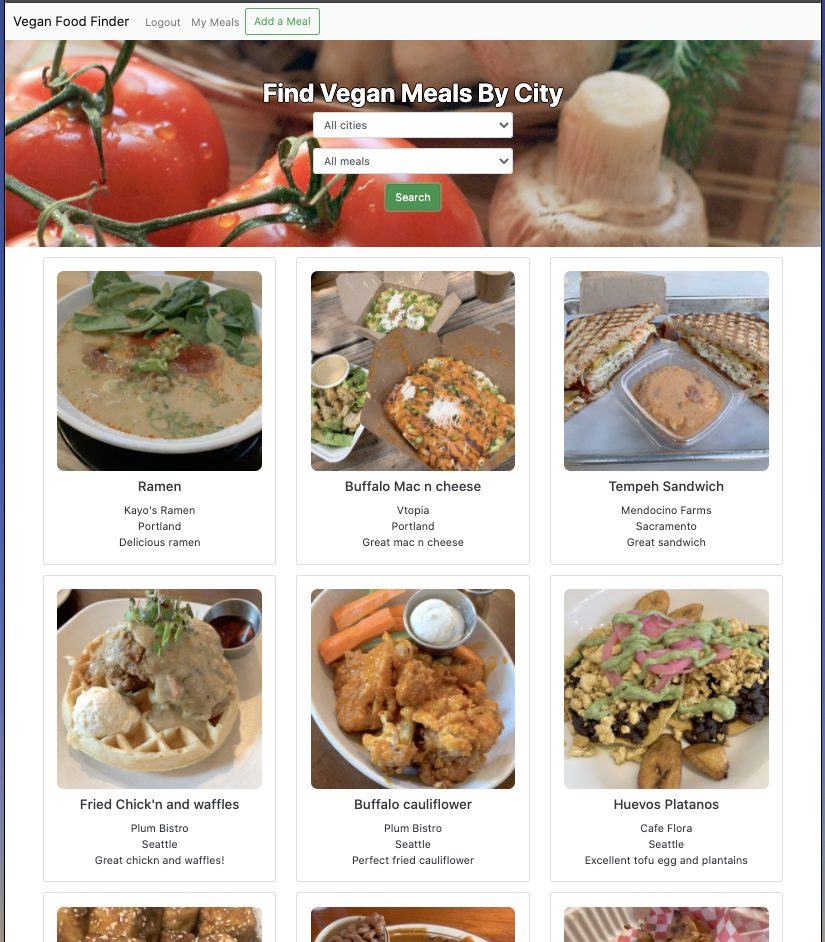
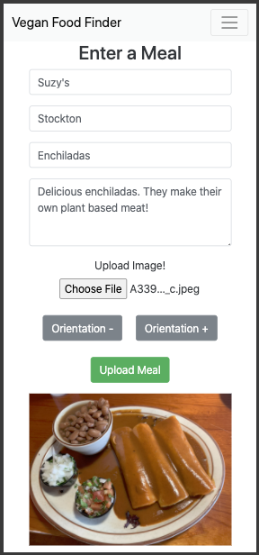
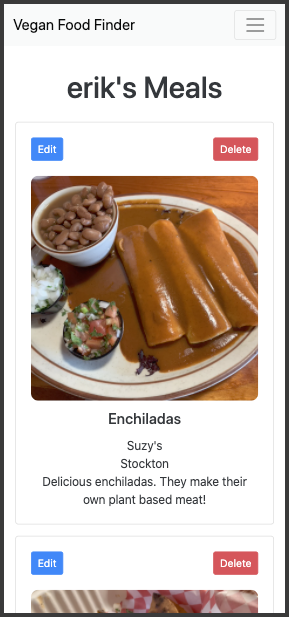
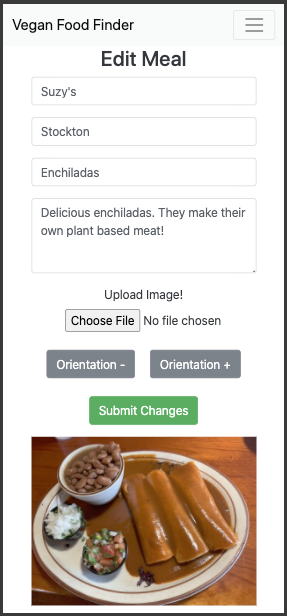

# Vegan Food Finder

App hosted on Heroku: https://vegan-food-find.herokuapp.com

- A MERN full stack application that allows users to upload meals with images and provides an interactive search selector for finding meals by city

- Session based authentication using passport.js and stored with React Context

- MongoDB Atlas management and integration

- Image EXIF data stripped upon upload and users can choose image orientation, edit and delete their posts

- Mobile responsive design utilizing Bootstrap

## Technologies used

- React w/ Context
- Bootstrap
- NodeJS
- Express
- Passport
- Bcrypt
- MongoDB
- Piexifjs
- Heroku CI/CD

## Deployment

Continuous Deployment with Heroku.
- Project root package.json instructs Heroku to build out the front and back end.

## Views

### Homepage



### Add/View/Edit User Meals

<p float="left">
	
	
    
</p>

## App File Structure

- [backend](backend)
	- [src](src)
		- [Interfaces](backend/src/Interfaces)
			- Contains a typescript file that defines object structures and key types
		- [index.ts](backend/src/index.ts)
		 	- Server file. Contains RESTful API and serves react build
		- [User.ts](backend/src/User.ts)
		 	- Mongoose schema definitions
- [client](client)
	- [public](client/public)
		- [index.html](client/public/index.html)
			- Root HTML file. Importantly, body div has id="root"
	- [src](client/src)
		- [Components](client/src/Components)
			- Reusable react components
		- [Interfaces](client/src/Interfaces)
			- Contains a typescript file that defines object structures and key types
		- [Pages](client/src/Pages)
			- Page level react components. Routed to with React BrowserRouter
		- [App.tsx](client/src/App.tsx)
			- Conditionally routes to components with BrowserRouter depending on global authentication state provided by Context
		- [index.tsx](client/src/index.tsx)
			- Uses ReactDOM to render App.tsx, wrapped in Context, to the "root" element in index.html
		- [main.css](client/src/main.css)
			- CSS file for front end styling. 
- [package.json](package.json)
	- Provides instructions for Heroku to install npm modules, build out the front and back end, and start the app

## MongoDB Atlas DB Structure
```
|-- veganFoodFind (database)
|   |-- users (collection)
|   |   |-- user (record)
|   |   |   |-- _id (ObjectId created by Mongo)
|   |   |   |-- isAdmin (false by default)
|   |   |   |-- username (set by user on registration)
|   |   |   |-- password (set by user on registration + salted + hashed)
|   |   |   |-- posts (Array)
|   |   |   |   |-- Object
|   |   |   |   |   |-- _id (ObjectId created by Mongo)
|   |   |   |   |   |-- restaurant (set by user)
|   |   |   |   |   |-- city (set by user)
|   |   |   |   |   |-- meal (set by user)
|   |   |   |   |   |-- description (set by user)
|   |   |   |   |   |-- picture (set by user, base64 encoded string)
```

## Future improvements
- Currently, the images are stored directly in MongoDB as base64 encoded strings  
&#8594; Better practice would be to store images in AWS S3 buckets and reference them in MongoDB

- Images should be compressed to save space and improve loading time

- Project is written in Typescript but most types need to be defined
