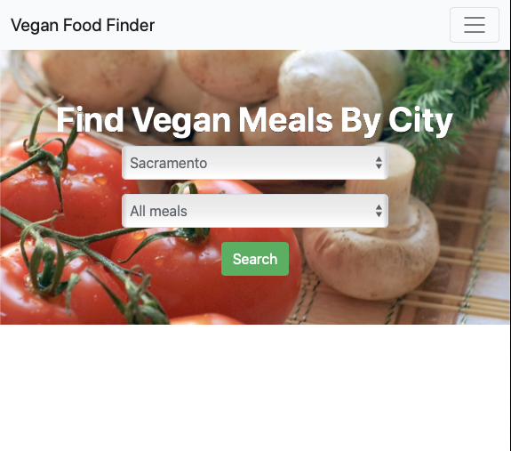

# Vegan Food Finder

Site hosted on Heroku: https://vegan-food-find.herokuapp.com

- A fullstack application that allows users to upload meals with images and provides an interactive search selector for finding meals by city.

- Image EXIF data stripped upon upload and users can choose image orientation, edit, and delete their posts.

- Registration and login implemented with session based authentication using passport.js

- Built react frontend is served by NodeJS backend.

## Technologies Used:

- React
- Bootstrap
- NodeJS
- Express
- Passport
- Bcrypt
- MongoDB
- Piexifjs
- Heroku CI/CD

## Deployment:

Continuous Deployment with Heroku.
- Project root package.json instructs Heroku to build out the front and back end

## Views:

Homepage

